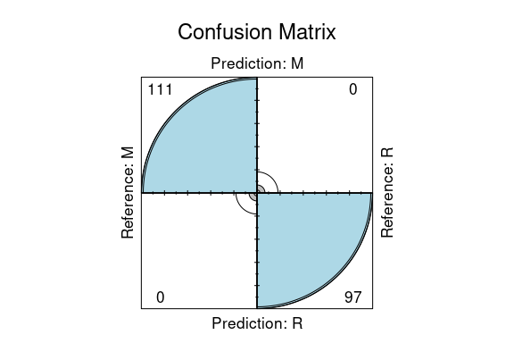
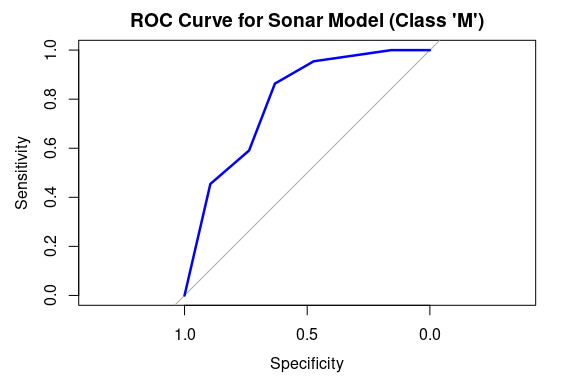

Business Intelligence Lab Submission Markdown
================
Lumin
1/10/23

- [Student Details](#student-details)
- [Setup Chunk](#setup-chunk)
- [1: Install and Load Required
  Packages:](#1-install-and-load-required-packages)
- [2. Accuracy and Cohen’s Kappa —-](#2-accuracy-and-cohens-kappa--)
  - [2.1 Confusion Matrix.](#21-confusion-matrix)
    - [2.2. Display a graphical confusion
      matrix](#22-display-a-graphical-confusion-matrix)
- [3. RMSE, R Squared, and MAE:](#3-rmse-r-squared-and-mae)
- [4. Area Under ROC Curve:](#4-area-under-roc-curve)
- [5. Logarithmic Loss (LogLoss):](#5-logarithmic-loss-logloss)

# Student Details

<table style="width:99%;">
<colgroup>
<col style="width: 32%" />
<col style="width: 63%" />
<col style="width: 3%" />
</colgroup>
<tbody>
<tr class="odd">
<td><strong>Student ID Numbers and Names of Group Members</strong></td>
<td colspan="2"><pre><code>                                                                                                 |</code></pre>
<ol type="1">
<li>112827 - A - Mungai Kenneth | |</li>
<li>123324 - B - Kelly Noella Sota | |</li>
<li>134265 - A - Emmanuel Kiptoo | | | | |</li>
</ol></td>
</tr>
<tr class="even">
<td><strong>GitHub Classroom Group Name</strong></td>
<td colspan="2">Lumin</td>
</tr>
<tr class="odd">
<td><strong>Course Code</strong></td>
<td>BBT4206</td>
<td></td>
</tr>
<tr class="even">
<td><strong>Course Name</strong></td>
<td>Business Intelligence II</td>
<td></td>
</tr>
<tr class="odd">
<td><strong>Program</strong></td>
<td>Bachelor of Business Information Technology</td>
<td></td>
</tr>
<tr class="even">
<td><strong>Semester Duration</strong></td>
<td>21<sup>st</sup> August 2023 to 28<sup>th</sup> November 2023</td>
<td></td>
</tr>
</tbody>
</table>

# Setup Chunk

**Note:** the following “*KnitR*” options have been set as the
defaults:  
`knitr::opts_chunk$set(echo = TRUE, warning = FALSE, eval = TRUE, collapse = FALSE, tidy.opts = list(width.cutoff = 80), tidy = TRUE)`.

More KnitR options are documented here
<https://bookdown.org/yihui/rmarkdown-cookbook/chunk-options.html> and
here <https://yihui.org/knitr/options/>.

**Note:** the following “*R Markdown*” options have been set as the
defaults:

> output:  
>   
> github_document:  
> toc: yes  
> toc_depth: 4  
> fig_width: 6  
> fig_height: 4  
> df_print: default  
>   
> editor_options:  
> chunk_output_type: console

# 1: Install and Load Required Packages:

In this step, we ensure that the necessary R packages are installed and
loaded. Packages are collections of R functions, data, and compiled code
that extend the functionality of R. The install.packages() function is
used to install packages, and library() is used to load them.

``` r
if (require("languageserver")) {
    require("languageserver")
} else {
    install.packages("languageserver", dependencies = TRUE, repos = "https://cloud.r-project.org")
}
```

    ## Loading required package: languageserver

``` r
# STEP 1. Install and Load the Required Packages ---- ggplot2 ----
if (require("ggplot2")) {
    require("ggplot2")
} else {
    install.packages("ggplot2", dependencies = TRUE, repos = "https://cloud.r-project.org")
}
```

    ## Loading required package: ggplot2

``` r
## caret ----
if (require("caret")) {
    require("caret")
} else {
    install.packages("caret", dependencies = TRUE, repos = "https://cloud.r-project.org")
}
```

    ## Loading required package: caret

    ## Loading required package: lattice

``` r
## mlbench ----
if (require("mlbench")) {
    require("mlbench")
} else {
    install.packages("mlbench", dependencies = TRUE, repos = "https://cloud.r-project.org")
}
```

    ## Loading required package: mlbench

``` r
## pROC ----
if (require("pROC")) {
    require("pROC")
} else {
    install.packages("pROC", dependencies = TRUE, repos = "https://cloud.r-project.org")
}
```

    ## Loading required package: pROC

    ## Type 'citation("pROC")' for a citation.

    ## 
    ## Attaching package: 'pROC'

    ## The following objects are masked from 'package:stats':
    ## 
    ##     cov, smooth, var

``` r
## dplyr ----
if (require("dplyr")) {
    require("dplyr")
} else {
    install.packages("dplyr", dependencies = TRUE, repos = "https://cloud.r-project.org")
}
```

    ## Loading required package: dplyr

    ## 
    ## Attaching package: 'dplyr'

    ## The following objects are masked from 'package:stats':
    ## 
    ##     filter, lag

    ## The following objects are masked from 'package:base':
    ## 
    ##     intersect, setdiff, setequal, union

``` r
library(readr)
```

# 2. Accuracy and Cohen’s Kappa —-

This code snippet is used to perform classification tasks on the “Sonar”
dataset. Firstly, it loads the dataset and sets a random seed for
reproducibility. It then calculates the baseline accuracy for the
classification task. The dataset is split into training and testing sets
using a 75:25 split. A logistic regression model is trained on the
training data using 5-fold cross-validation.

``` r
## 2.a. Load the dataset ----
data("Sonar")

# Set a random seed for reproducibility
set.seed(123)

# Create a data frame with the target variable and features
df <- as.data.frame(Sonar)


## 2.b. Determine the Baseline Accuracy ---- Determine the baseline accuracy
sonar_freq <- Sonar$Class
baseline_accuracy <- sum(sonar_freq == "M")/length(sonar_freq)
cat("Baseline Accuracy:", baseline_accuracy, "\n")
```

    ## Baseline Accuracy: 0.5336538

``` r
# Define the training control with 5-fold cross-validation
train_control <- trainControl(method = "cv", number = 5)

## 2.c. Split the dataset ---- Split the dataset into a 75:25 train:test data
## split
n_train <- round(0.75 * nrow(df))
train_data <- df[1:n_train, ]
test_data <- df[(n_train + 1):nrow(df), ]

## 2.d. Train the Model ---- Train a classification model (e.g., logistic
## regression) with 5-fold cross-validation
model <- train(Class ~ ., data = train_data, method = "glm", metric = "Accuracy",
    trControl = train_control)

# Display the model's performance using the metric calculated by caret when
# training the model
print(model)
```

    ## Generalized Linear Model 
    ## 
    ## 156 samples
    ##  60 predictor
    ##   2 classes: 'M', 'R' 
    ## 
    ## No pre-processing
    ## Resampling: Cross-Validated (5 fold) 
    ## Summary of sample sizes: 124, 125, 125, 125, 125 
    ## Resampling results:
    ## 
    ##   Accuracy   Kappa    
    ##   0.7241935  0.4147312

``` r
library(readr)
```

## 2.1 Confusion Matrix.

This code loads the “Sonar” dataset, creates a data frame, and trains a
classification model (e.g., random forest) using 5-fold
cross-validation. It then predicts target values, computes a confusion
matrix, and presents classification metrics like accuracy and error
rates for the “Sonar” dataset.

``` r
# Load the Sonar dataset
data("Sonar")

# Set a random seed for reproducibility
set.seed(123)

# Create a data frame with the target variable and features
df <- as.data.frame(Sonar)

# Define the training control (e.g., 5-fold cross-validation)
train_control <- trainControl(method = "cv", number = 5)

# Train a classification model (e.g., random forest, support vector machine,
# etc.)
model <- train(Class ~ ., data = df, method = "rf", trControl = train_control)

# Predict on the test set (in this example, using the same data for
# illustration)
predictions <- predict(model, newdata = df)

# Compute a confusion matrix and other classification metrics
confusion_matrix <- confusionMatrix(predictions, df$Class)
print(confusion_matrix)
```

    ## Confusion Matrix and Statistics
    ## 
    ##           Reference
    ## Prediction   M   R
    ##          M 111   0
    ##          R   0  97
    ##                                      
    ##                Accuracy : 1          
    ##                  95% CI : (0.9824, 1)
    ##     No Information Rate : 0.5337     
    ##     P-Value [Acc > NIR] : < 2.2e-16  
    ##                                      
    ##                   Kappa : 1          
    ##                                      
    ##  Mcnemar's Test P-Value : NA         
    ##                                      
    ##             Sensitivity : 1.0000     
    ##             Specificity : 1.0000     
    ##          Pos Pred Value : 1.0000     
    ##          Neg Pred Value : 1.0000     
    ##              Prevalence : 0.5337     
    ##          Detection Rate : 0.5337     
    ##    Detection Prevalence : 0.5337     
    ##       Balanced Accuracy : 1.0000     
    ##                                      
    ##        'Positive' Class : M          
    ## 

``` r
library(readr)
```

### 2.2. Display a graphical confusion matrix

The code uses ggplot2 to create a heatmap visualization of a confusion
matrix for a classification model. It represents actual values on the
x-axis, predicted values on the y-axis, and cell colors indicate
prediction frequencies. It aims to provide a clear representation of
model performance. The fourfoldplot function is an alternative but less
common way to visualize the confusion matrix.
`{step-four-chunk} # Visualizing Confusion Matrix # Assuming 'confusion_matrix' is the confusion matrix you've computed library(ggplot2) confusion_df <- as.data.frame(as.table(confusion_matrix)) ggplot(data = confusion_df, aes(x = Reference, y = Prediction, fill = Freq)) +   geom_tile() +   labs(x = "Actual", y = "Predicted", fill = "Frequency") +   scale_fill_gradient(low = "lightblue", high = "red") +   theme_minimal() +   theme(axis.text.x = element_text(angle = 90, hjust = 1)) +   ggtitle("Confusion Matrix") library(readr)`

``` r
fourfoldplot(as.table(confusion_matrix), color = c("grey", "lightblue"), main = "Confusion Matrix")
```

<!-- -->

# 3. RMSE, R Squared, and MAE:

This code focuses on a regression task using the mtcars dataset. It
starts by splitting the data into a training and test set (75:25), then
trains a linear regression model with 5-fold cross-validation. The code
calculates and displays various regression performance metrics,
including RMSE, SSR, SST, R-squared, and MAE.

``` r
## 2.a. Load the dataset ----
data("mtcars")

summary("mtcars")
```

    ##    Length     Class      Mode 
    ##         1 character character

``` r
# Set a random seed for reproducibility
set.seed(123)

# Create a data frame with the target variable and features
df <- as.data.frame(mtcars)

# Define the training control with 5-fold cross-validation
train_control <- trainControl(method = "cv", number = 5)

## 2.b. Split the dataset ---- Split the dataset into a 75:25 train:test data
## split
n_train <- round(0.75 * nrow(df))
train_data <- df[1:n_train, ]
test_data <- df[(n_train + 1):nrow(df), ]

# Train a linear regression model with 5-fold cross-validation
model <- train(mpg ~ ., data = train_data, method = "lm", trControl = train_control)

# Display the model's performance using the metric calculated by caret when
# training the model
print(model)
```

    ## Linear Regression 
    ## 
    ## 24 samples
    ## 10 predictors
    ## 
    ## No pre-processing
    ## Resampling: Cross-Validated (5 fold) 
    ## Summary of sample sizes: 20, 19, 19, 19, 19 
    ## Resampling results:
    ## 
    ##   RMSE      Rsquared   MAE     
    ##   4.348654  0.6552257  3.471317
    ## 
    ## Tuning parameter 'intercept' was held constant at a value of TRUE

``` r
# Predict on the test set
predictions <- predict(model, newdata = test_data)

# Calculate RMSE
rmse <- sqrt(mean((test_data$mpg - predictions)^2))
cat("RMSE =", rmse, "\n")
```

    ## RMSE = 4.292271

``` r
# Calculate SSR
ssr <- sum((test_data$mpg - predictions)^2)
cat("SSR =", ssr, "\n")
```

    ## SSR = 147.3887

``` r
# Calculate SST
sst <- sum((test_data$mpg - mean(test_data$mpg))^2)
cat("SST =", sst, "\n")
```

    ## SST = 215.4

``` r
# Calculate R-squared
r_squared <- 1 - (ssr/sst)
cat("R-squared =", r_squared, "\n")
```

    ## R-squared = 0.3157442

``` r
# Calculate MAE
absolute_errors <- abs(predictions - test_data$mpg)
mae <- mean(absolute_errors)
cat("MAE =", mae, "\n")
```

    ## MAE = 3.948922

``` r
library(readr)
```

# 4. Area Under ROC Curve:

This code deals with a K-nearest neighbors (KNN) classification model
applied to the Sonar dataset. It begins by splitting the data into
training and testing sets (80:20), then trains the KNN model with
10-fold cross-validation, focusing on ROC as the evaluation metric. The
code calculates and displays the model’s sensitivity (True Positive
Rate), specificity (True Negative Rate), and AUC (Area Under ROC Curve)
using the test dataset. It also generates and plots the ROC curve to
visualize the model’s performance in distinguishing the “M” class.

``` r
library(pROC)

# Split the dataset into a training and testing set
set.seed(7)
train_index <- createDataPartition(Sonar$Class, p = 0.8, list = FALSE)
sonar_train <- Sonar[train_index, ]
sonar_test <- Sonar[-train_index, ]

# Train the KNN model
train_control <- trainControl(method = "cv", number = 10, classProbs = TRUE, summaryFunction = twoClassSummary)
knn_model <- train(Class ~ ., data = sonar_train, method = "knn", metric = "ROC",
    trControl = train_control)

# Display the model's performance using the metric calculated by caret when
# training the model
print(knn_model)
```

    ## k-Nearest Neighbors 
    ## 
    ## 167 samples
    ##  60 predictor
    ##   2 classes: 'M', 'R' 
    ## 
    ## No pre-processing
    ## Resampling: Cross-Validated (10 fold) 
    ## Summary of sample sizes: 151, 150, 151, 150, 150, 150, ... 
    ## Resampling results across tuning parameters:
    ## 
    ##   k  ROC        Sens       Spec     
    ##   5  0.8584325  0.8222222  0.6678571
    ##   7  0.8112351  0.7763889  0.6553571
    ##   9  0.7914559  0.7986111  0.5535714
    ## 
    ## ROC was used to select the optimal model using the largest value.
    ## The final value used for the model was k = 5.

``` r
# Compute the metric yourself using the test dataset Sensitivity and
# Specificity
predictions <- predict(knn_model, sonar_test[, -ncol(sonar_test)])
actual_labels <- sonar_test$Class  # Use the actual class labels from the test dataset

conf_matrix <- confusionMatrix(predictions, actual_labels)
sensitivity <- conf_matrix$byClass["Sensitivity"]
specificity <- conf_matrix$byClass["Specificity"]

cat("Sensitivity (True Positive Rate) =", sensitivity, "\n")
```

    ## Sensitivity (True Positive Rate) = 0.8636364

``` r
cat("Specificity (True Negative Rate) =", specificity, "\n")
```

    ## Specificity (True Negative Rate) = 0.6315789

``` r
# AUC
predictions_prob <- as.numeric(predict(knn_model, sonar_test[, -ncol(sonar_test)],
    type = "prob")[, "M"])
roc_curve <- roc(ifelse(actual_labels == "M", 1, 0), predictions_prob)
```

    ## Setting levels: control = 0, case = 1

    ## Setting direction: controls < cases

``` r
cat("AUC (Area Under ROC Curve) =", auc(roc_curve), "\n")
```

    ## AUC (Area Under ROC Curve) = 0.7930622

``` r
# Plot the ROC curve
plot(roc_curve, main = "ROC Curve for Sonar Model (Class 'M')", col = "blue", lwd = 2.5)
```

<!-- -->

``` r
library(readr)
```

# 5. Logarithmic Loss (LogLoss):

In this code, the BreastCancer dataset is loaded and processed to handle
missing values using the “mice” package for imputations. Five imputed
datasets are created and then combined. A classification model,
specifically a decision tree (rpart), is trained on the BreastCancer
dataset with 5-fold repeated cross-validation. The performance of the
model, evaluated using the log loss metric, is displayed.

``` r
# Load the BreastCancer dataset
data(BreastCancer)

## 4.a. Handle Missing Values ---- Load the BreastCancer dataset
data(BreastCancer)

## 4.a. Handle Missing Values ---- Load the BreastCancer dataset Load the
## BreastCancer dataset
data(BreastCancer)

# Load the mice package for imputations
library(mice)
```

    ## 
    ## Attaching package: 'mice'

    ## The following object is masked from 'package:stats':
    ## 
    ##     filter

    ## The following objects are masked from 'package:base':
    ## 
    ##     cbind, rbind

``` r
# Impute missing values using mice
imputed_data <- mice(BreastCancer, method = "pmm", m = 5)  # You can change 'm' as needed
```

    ## 
    ##  iter imp variable
    ##   1   1  Bare.nuclei
    ##   1   2  Bare.nuclei
    ##   1   3  Bare.nuclei
    ##   1   4  Bare.nuclei
    ##   1   5  Bare.nuclei
    ##   2   1  Bare.nuclei
    ##   2   2  Bare.nuclei
    ##   2   3  Bare.nuclei
    ##   2   4  Bare.nuclei
    ##   2   5  Bare.nuclei
    ##   3   1  Bare.nuclei
    ##   3   2  Bare.nuclei
    ##   3   3  Bare.nuclei
    ##   3   4  Bare.nuclei
    ##   3   5  Bare.nuclei
    ##   4   1  Bare.nuclei
    ##   4   2  Bare.nuclei
    ##   4   3  Bare.nuclei
    ##   4   4  Bare.nuclei
    ##   4   5  Bare.nuclei
    ##   5   1  Bare.nuclei
    ##   5   2  Bare.nuclei
    ##   5   3  Bare.nuclei
    ##   5   4  Bare.nuclei
    ##   5   5  Bare.nuclei

``` r
# Combine the imputed datasets
completed_data <- complete(imputed_data)

# 4.a. Train the Model We apply the 5-fold repeated cross-validation resampling
# method with 3 repeats.
train_control <- trainControl(method = "repeatedcv", number = 5, repeats = 3, classProbs = TRUE,
    summaryFunction = mnLogLoss)
set.seed(7)

# Train a classification model on the BreastCancer dataset.  In this case, we
# use a decision tree (rpart) as an example model.
BreastCancer_model_rpart <- train(Class ~ ., data = completed_data, method = "rpart",
    metric = "logLoss", trControl = train_control)

# 4.b. Display the Model's Performance Use the metric calculated by caret when
# training the model.
print(BreastCancer_model_rpart)
```

    ## CART 
    ## 
    ## 699 samples
    ##  10 predictor
    ##   2 classes: 'benign', 'malignant' 
    ## 
    ## No pre-processing
    ## Resampling: Cross-Validated (5 fold, repeated 3 times) 
    ## Summary of sample sizes: 560, 558, 559, 560, 559, 560, ... 
    ## Resampling results across tuning parameters:
    ## 
    ##   cp          logLoss  
    ##   0.02074689  0.2703623
    ##   0.05394191  0.2594033
    ##   0.78008299  0.3860437
    ## 
    ## logLoss was used to select the optimal model using the smallest value.
    ## The final value used for the model was cp = 0.05394191.

``` r
library(readr)
```
